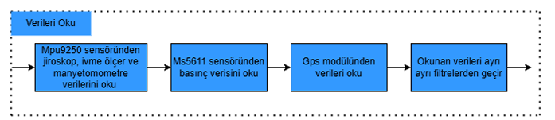
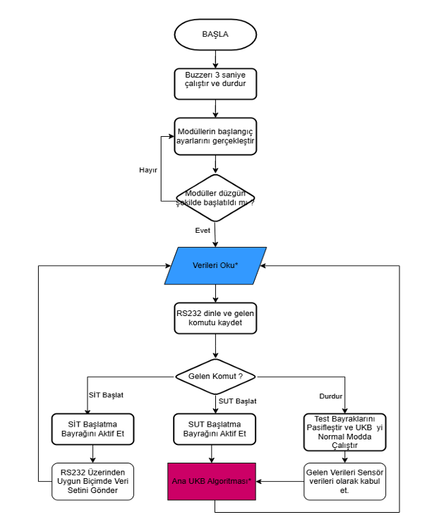
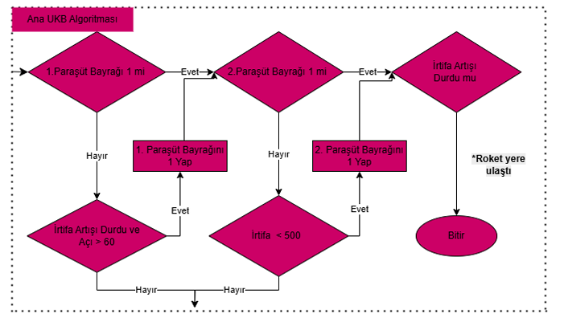

# 🚀 Kuara Rocket Team - O-UKB Flight Control Software (SIT/SUT Verified)

## 🇹🇷 Proje Hakkında (Turkish)

Bu depo, **Kuara Roket Takımı** Aviyonik Birimi tarafından **TEKNOFEST Orta İrtifa Roket Yarışması** kapsamında geliştirilen özgün Uçuş Kontrol Bilgisayarı'nın (O-UKB) gömülü yazılımını içerir.

Yazılım, **STM32F407** tabanlı donanım üzerinde çalışmakta olup, Roketsan tarafından belirlenen **SUT (Sistem Uyumluluk Testi)** ve **SİT (Sistem İşletim Testi)** süreçlerini başarıyla tamamlamıştır. Veri paketleri, ilgili yarışma şartnamesine uygun olarak **Big Endian** formatına dönüştürülerek yer istasyonuna aktarılmaktadır.

### 🛠 Donanım Özellikleri
Aşağıdaki modüller ile tam uyumlu çalışmaktadır:

| Bileşen | Model | Açıklama |
| :--- | :--- | :--- |
| **MCU** | STM32F407VGT6 | ARM Cortex-M4, 168 MHz |
| **IMU** | **MPU9250** | 9-Eksen (İvme, Jiro, Manyetometre) |
| **Barometre** | **MS5611** | Yüksek hassasiyetli basınç ve irtifa sensörü |
| **GPS** | **NEO-6M** | Konum verisi (NEO-7M ve 8M uyumlu) |
| **Telemetri** | **E22-900T22D** | LoRa Modülü (Uzun menzilli haberleşme) |

### ⚙️ Yazılım Mimarisi ve Algoritmalar

Sistemin genel çalışma mantığı, başlangıç (init), sensör okuma, komut işleme (RS232) ve ana uçuş döngüsü (Main Loop) adımlarından oluşur.

#### Genel Sistem Akışı
Aşağıdaki diyagram, sistemin enerji verildiği andan itibaren izlediği ana yolu ve test modları (SİT/SUT) ile normal uçuş modu arasındaki geçişleri göstermektedir.

 Veri Okuma ve Filtreleme
Sensörlerden (MPU9250, MS5611, GPS) ham veriler okunur ve her biri kendi karakteristiğine uygun filtrelerden geçirilerek gürültüden arındırılır.

 
* **Interrupt Tabanlı Dinleme:** GPS modülü ve RS232 portu, çalışma modunu  algılama amacıyla `Interrupt` (Kesme) rutini ile sürekli dinlenmektedir.
* **GPS Yönetimi:** NMEA formatını çözümlemek için `lwgps` kütüphanesi entegre edilmiştir.
* **Roketsan Veri Formatı:** UKB verileri, telemetri hattına gönderilmeden önce **Big Endian** formatına dönüştürülür.

#### Ana Uçuş Algoritması (Apogee ve Paraşüt)
Roketin uçuşu sırasında tepe noktası (apogee) tespiti ve iki aşamalı paraşüt açma (sürüklenme ve ana paraşüt) işlemleri aşağıdaki durum makinesi (state machine) mantığı ile yönetilir.

 Algoritma, irtifa artışının durmasını (apogee) ve belirli irtifa/açı koşullarını kontrol ederek ilgili paraşüt bayraklarını (flags) aktif eder.

### ⚠️ Önemli Yapılandırma Notları (Configuration Notes)

Projeyi derlemeden veya donanımı kurmadan önce aşağıdaki notlara dikkat ediniz:

1.  **RF Ayarları (LoRa):** E22-900T22D modülünü kullanmadan önce *RF Settings* uygulaması ile yapılandırın. Kod içerisindeki HEX adres ve kanal değerleri bu ayarlarla eşleşmelidir.
2.  **Yer İstasyonu:** Bu repoda yer istasyonu arayüz kodu yoktur. Veriler USB-TTL dönüştürücü ile ham olarak izlenebilir.
3.  **GPS Modül Seçimi:** `lwgps` kütüphanesi sayesinde NEO-6M, 7M ve 8M modülleri desteklenmektedir.

---

## 🇺🇸 Project Description (English)

This repository contains the embedded software for the **STM32F407**-based Flight Control Computer (FCC) developed by **Kuara Rocket Team**. The system has successfully passed **SUT** and **SIT** tests mandated by **Roketsan**.

### Key Features
* **Roketsan Compliance:** Telemetry data converted to **Big Endian**.
* **Interrupt-Driven:** Continuous listening for GPS and RS232 ports.
* **Hardware Support:** MPU9250, MS5611, NEO-6M GPS, E22-900T22D LoRa.

### System Flowcharts

* **General System Flow:** Shows startup, initialization, and mode switching (SIT/SUT/Normal).
    
* **Data Acquisition:** Illustrates reading and filtering data from IMU, Barometer, and GPS.
    
* **Main Flight Algorithm:** Details the logic for apogee detection and dual-stage parachute deployment.
    

## 💾 Kurulum / Build & Flash

1.  STM32CubeIDE ile projeyi açın.
2.  RF ayarlarınızı güncelleyin.
3.  Derleyin ve yükleyin.

## 👨‍💻 Ekip / Team
**Kuara Rocket Team - Avionics Unit**

---
*Gazi Üniversitesi & TEKNOFEST 2025*
